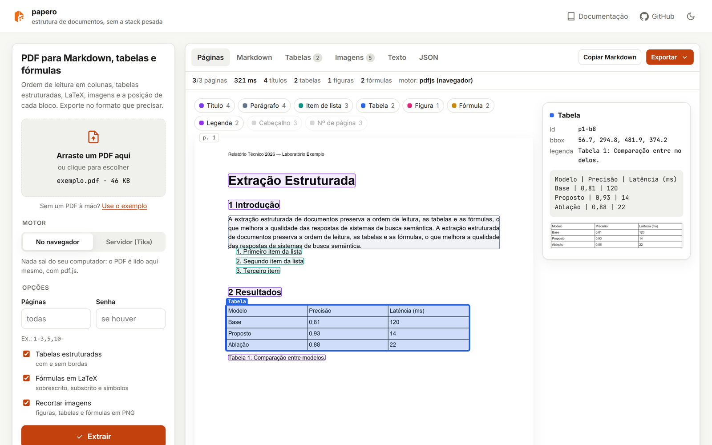
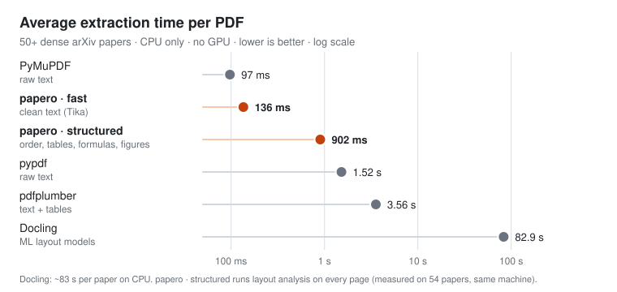

<p align="center">
  <picture>
    <source media="(prefers-color-scheme: dark)" srcset="web/assets/logo-dark.png">
    
  </picture>
</p>

<h3 align="center">Document structure extraction without the heavyweight stack.</h3>

<p align="center">
  PDF → Markdown · JSON · Word · Excel — with reading order, tables, formulas, figures and the position of every block.<br>
  CPU only. No ML models. Runs in your browser, in Python, or as an API.
</p>

<p align="center">
  <a href="https://github.com/beatrizalmeidaf/pdf-text-extractor/actions/workflows/ci.yml"></a>
  
  <a href="LICENSE"></a>
  
</p>

<p align="center">
  <a href="https://beatrizalmeidaf.github.io/pdf-text-extractor/"><b>▶ Try it in your browser</b></a>
  &nbsp;·&nbsp;
  <a href="#quick-start"><b>Quick start</b></a>
  &nbsp;·&nbsp;
  <a href="#benchmarks"><b>Benchmarks</b></a>
</p>

<p align="center">
  <a href="https://beatrizalmeidaf.github.io/pdf-text-extractor/">
    
  </a>
  <br>
  <sub>The browser app: each block outlined where it sits on the page — click one to see its type, position and content. Your PDF never leaves your machine.</sub>
</p>

---

## Why papero

Getting the *text* out of a PDF is easy. Getting its **structure** back — which column comes first, which lines are a table, where the formula is — is what makes the output usable for RAG, search and LLMs. papero does that with plain geometry, so it stays fast on a laptop CPU.

<table>
  <tr>
    <td width="33%" valign="top">
      <b>📖 Reading order</b><br>
      Two- and three-column papers read column by column. Headers, footers, page numbers and repeated logos are set aside.
    </td>
    <td width="33%" valign="top">
      <b>▦ Real tables</b><br>
      Ruled, borderless and LaTeX <i>booktabs</i> tables come back as rows and columns — multi-line cells included. Export to CSV or Excel.
    </td>
    <td width="33%" valign="top">
      <b>∑ Formulas</b><br>
      Superscripts, subscripts and math symbols become LaTeX (<code>E = mc^{2}</code>), plus a cropped image of the formula.
    </td>
  </tr>
  <tr>
    <td valign="top">
      <b>📍 Position of everything</b><br>
      Every block has a bounding box — cite the exact spot in a RAG answer, draw over the page, or crop it.
    </td>
    <td valign="top">
      <b>🖼 Figures &amp; charts</b><br>
      Images and vector charts are cropped to PNG, with their caption, axis labels and legend kept together.
    </td>
    <td valign="top">
      <b>📝 Back to Word</b><br>
      Alignment, indents, line spacing, bold runs and fonts are kept, so a <code>.docx</code> export looks like the original page.
    </td>
  </tr>
</table>

Also: accents drawn as separate glyphs in LaTeX PDFs (`Computa¸ca˜o` → `Computação`), invisible white text used by form generators is dropped, scanned pages go through OCR, and DOCX/PPTX/XLSX/EPUB/HTML are read through Apache Tika.

## Quick start

```bash
pip install pdf-text-api
```

```python
from pdf_text_api import extract

doc = extract("paper.pdf")
print(doc.to_markdown())
```

Or skip the install: **[open the browser app](https://beatrizalmeidaf.github.io/pdf-text-extractor/)**, drop a PDF, export to the format you need.

<details>
<summary><b>More Python</b> — tables, formulas, positions, images, options</summary>

```python
from pdf_text_api import extract, extract_text

doc = extract("paper.pdf", images=True)

doc.tables[0].rows  # [["Model", "Accuracy"], ["Base", "0.81"], ...]
doc.formulas[0].latex  # "E = mc^{2}"
doc.figures[0].image.data  # PNG bytes

for block in doc.pages[0].blocks:  # reading order, with positions
    print(block.type, block.bbox, block.text[:60])

doc.to_html()  # keeps alignment and indents
doc.to_dict()  # the full JSON

extract("slides.pptx").to_markdown()  # any format Apache Tika reads
extract_text("contract.pdf").text  # fastest: clean text only
```

| Option | Default | |
|---|---|---|
| `pages` | all | `"1-3,5,10-"` |
| `images` | `False` | crop figures, tables and formulas to PNG |
| `tables` / `formulas` | `True` | detection on/off |
| `ocr` | `"auto"` | `"auto"` (scanned pages only), `"force"`, `"off"` |
| `ocr_language` | `"por+eng"` | Tesseract languages |
| `tika` | `True` | `False` runs the layout engine alone (no Java) |
| `workers` | `1` | processes for long documents |

</details>

<details>
<summary><b>CLI</b></summary>

```bash
pdf-text-api extract paper.pdf -o paper.md --images   # Markdown + images/ folder
pdf-text-api extract paper.pdf -o paper.json          # format from the extension
pdf-text-api extract paper.pdf -f csv -o tables.csv   # tables only
pdf-text-api extract paper.pdf -p 1-5 -f html
pdf-text-api extract paper.pdf --fast                 # clean text only
pdf-text-api serve --port 8000                        # API + browser app
```

</details>

<details>
<summary><b>REST API &amp; Docker</b></summary>

```bash
docker compose up        # API + Apache Tika + Tesseract + browser app on :8000
```

```bash
curl -F "file=@paper.pdf" "localhost:8000/v1/extract?format=markdown"
curl -F "file=@paper.pdf" "localhost:8000/v1/extract?format=zip&images=true" -o paper.zip
curl -F "file=@paper.pdf" "localhost:8000/v1/extract?per_page=true"     # blocks + positions
```

One endpoint, `POST /v1/extract`; interactive docs at `/docs`.

| Parameter | Default | |
|---|---|---|
| `mode` | `structured` | `structured` (layout + Tika) or `fast` (text only) |
| `format` | `json` | `json`, `markdown`, `text`, `html`, `csv`, `zip` |
| `pages` | all | `1-3,5,10-` |
| `per_page` | `false` | include pages, blocks and positions in the JSON |
| `images` | `false` | crop figures, tables and formulas |
| `ocr` | `auto` | `auto`, `force`, `off` |

Configuration through environment variables — see [`.env.example`](.env.example).

</details>

## What comes out

Every block knows what it is and where it was:

```json
{
  "type": "table",
  "bbox": [56.7, 294.8, 481.9, 374.2],
  "rows": [["Model", "Accuracy"], ["Base", "0.81"]],
  "caption": "Table 1: Comparison between models."
}
```

| Output | Python · CLI · API | Browser app |
|---|:-:|:-:|
| Markdown, plain text, JSON | ✓ | ✓ |
| HTML (keeps alignment and indents) | ✓ | ✓ |
| CSV of the tables, ZIP with images | ✓ | ✓ |
| Word `.docx` that keeps the page's look | — | ✓ |
| Excel `.xlsx`, one sheet per table | — | ✓ |

<details>
<summary><b>Full JSON schema and block types</b></summary>

```json
{
  "schema": "pdf-text-api/document@1",
  "engine": "tika+pdfium",
  "page_count": 12,
  "metadata": { "title": "...", "author": "...", "language": "en" },
  "pages": [{
    "number": 1, "width": 595.3, "height": 841.9,
    "blocks": [{
      "id": "p1-b4", "type": "paragraph", "bbox": [74.0, 217.0, 522.0, 275.0],
      "text": "Atestamos que a estudante ...",
      "style": { "pt": 11.0, "font": "Arial", "bold": false },
      "format": { "align": "justify", "first_line": 42.7, "line_spacing": 1.8 },
      "runs": [{ "text": "FULANA DE TAL", "bold": true, "italic": false, "script": null }]
    }]
  }]
}
```

Block types: `heading` (with `level`), `paragraph`, `list_item` (with `marker`), `table` (with `rows`), `figure`, `formula` (with `latex`), `caption`, `code`, and — kept apart from the text — `header`, `footer`, `page_number`. Bounding boxes are `[x0, y0, x1, y1]` in points, origin at the top-left of the page.

</details>

## Benchmarks

<p align="center">
  
</p>

Dense arXiv papers (multi-column, formulas, tables, figures) on one laptop CPU, no GPU. `papero · fast` returns clean text; `papero · structured` also rebuilds reading order, tables, formulas and figures — **0 failures on 54 papers, 39 ms per page (median)**. Reproduce with [`benchmarks/`](benchmarks/).

| | papero | PyMuPDF | pdfplumber | pypdf | Docling | Marker |
|---|:-:|:-:|:-:|:-:|:-:|:-:|
| License | MIT | AGPL | MIT | BSD | MIT | GPL |
| Needs ML models / PyTorch | no | no | no | no | yes | yes |
| Multi-column reading order | ✓ | partial | — | — | ✓ | ✓ |
| Structured tables | ✓ | ✓ | ✓ | — | ✓ | ✓ |
| Formulas | LaTeX from glyphs + image | — | — | — | ✓ | ✓ |
| Bounding boxes | ✓ | ✓ | ✓ | — | ✓ | ✓ |
| DOCX / PPTX / XLSX / EPUB | ✓ | partial | — | — | ✓ | partial |
| Runs entirely in the browser | ✓ | — | — | — | — | — |

ML-based tools still win on very irregular layouts and complex math (stacked fractions, matrices) — papero gives you the formula as approximate LaTeX **and** as an image so nothing is lost.

## How it works

Two engines run on the same file **at the same time**:

- **A layout engine on PDFium** reads every glyph with its position, font and size, plus every rule and image, and rebuilds columns, tables, formulas, lists and figures with a column-aware XY-cut.
- **Apache Tika** adds metadata, tagged-PDF headings, OCR (Tesseract) and every non-PDF format.

The browser app runs the same algorithm ported to JavaScript on pdf.js, and CI checks block by block that both engines agree.

<details>
<summary><b>Limitations</b></summary>

- **Math:** LaTeX is rebuilt from glyphs — stacked fractions, matrices and big radicals come out linear (the cropped image is always there).
- **Borderless tables** with very narrow gaps between columns can read as text.
- **Scanned PDFs** need OCR, which runs on the server path (Tesseract is in the Docker image).
- **Word/Excel export** is in the browser app for now.

</details>

<details>
<summary><b>Development</b></summary>

```bash
git clone https://github.com/beatrizalmeidaf/pdf-text-extractor.git && cd pdf-text-extractor
pip install -e ".[dev]"
pytest -q                                   # includes real-world regressions
ruff check src tests && ruff format --check src tests
npm install --prefix tests/js && python tests/js/expected.py tests/js/out && node tests/js/parity.mjs tests/js/out
python -m http.server -d web                # browser app at http://localhost:8000
```

`src/pdf_text_api/` is the Python engine, API and CLI · `web/` is the browser app (GitHub Pages) · `tests/js/` checks the two engines agree · `benchmarks/` downloads the dataset and draws the chart.

</details>

## Contributing

Found a PDF papero gets wrong? **That's the most useful issue you can open** — attach the file (or a page of it) and say what you expected. Reading order, tables, formulas, encoding, OCR and browser/server differences are all fair game.

If papero saves you time, **a ⭐ helps other people find it.**

<sub>**Keywords:** PDF to Markdown · PDF to JSON · PDF to Word · PDF to Excel · PDF table extraction · PDF parser · document parsing · layout analysis · reading order · multi-column PDF · formula extraction · LaTeX · bounding boxes · OCR · Apache Tika · PDFium · pdf.js · RAG preprocessing · LLM document loader · Docling alternative · PyMuPDF alternative · converter PDF para Markdown, Word e Excel · extrair tabelas de PDF · extrair texto de PDF mantendo a formatação · OCR de PDF escaneado</sub>

<sub>MIT © Beatriz Almeida · package and imports keep the name `pdf-text-api` / `pdf_text_api` for compatibility.</sub>
