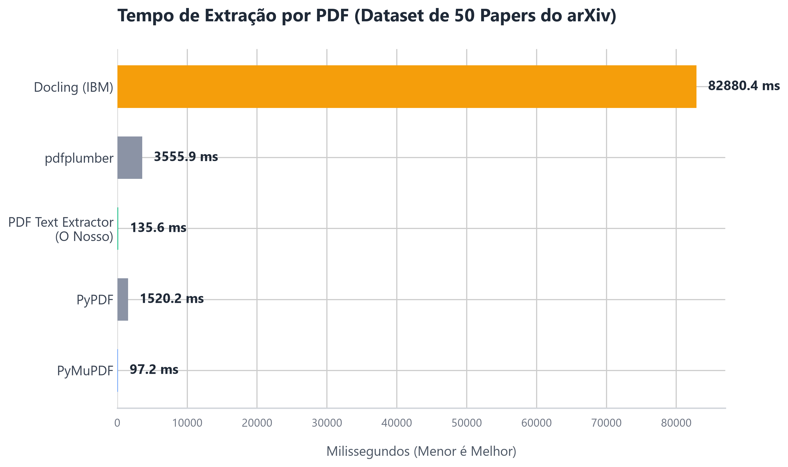

<p align="center">
  
</p>

<h1 align="center">PDF Text Extractor</h1>

<p align="center">
  <strong>O motor definitivo de extração de PDFs em Python, projetado para IA, RAG e LLMs.</strong><br>
  Converta PDFs para texto limpo e Markdown estruturado em altíssima velocidade. Open source e focado em performance.
</p>

<p align="center">
  <b>Keywords:</b> <code>pdf-to-markdown</code>, <code>rag-preprocessing</code>, <code>llm-data-loader</code>, <code>pdf-parser</code>, <code>docling-alternative</code>, <code>apache-tika</code>, <code>pdf-extraction</code>, <code>fastapi</code>, <code>python-pdf</code>
</p>

<p align="center">
  <a href="https://github.com/beatrizalmeidaf/pdf-text-extractor/actions/workflows/ci.yml"></a>
  <a href="https://github.com/beatrizalmeidaf/pdf-text-extractor/pkgs/container/pdf-text-extractor"></a>
  
  <a href="LICENSE"></a>
</p>

<p align="center">
  
  
  
  
</p>
---

## Extração em 10 segundos (Local)

Para testar rapidamente, suba a API localmente e rode no seu terminal:

```bash
curl -F "file=@contrato.pdf" "http://localhost:8000/v1/extract?format=text"
```

Pronto: o texto sai limpo, sem números de página nem cabeçalhos e rodapés repetidos, pronto para seu banco vetorial.

## Por que escolher essa ferramenta?

- **Saída em Markdown (PDF-to-Markdown):** Transforma PDFs diretamente em Markdown estruturado. Preserva títulos, hierarquias, listas e marcações. O pré-processador perfeito e nativo para **RAG** (Retrieval-Augmented Generation) e vetores de **LLMs**.
- **Performance Extrema:** Configuração "no OCR" customizada sobre o poderoso motor do **Apache Tika**, baixando a latência de extração textual para a casa dos milissegundos.
- **Extrator Robusto (PDF Parser):** Baseado no líder absoluto de mercado combinado com a leveza do **FastAPI**. Imune a problemas clássicos de espaçamento (kerning) e PDFs corrompidos ou mal formatados.
- **Limpeza Inteligente (PDF Scraper Seguro):** Esqueça dados sujos. A API identifica heurísticamente e remove margens, rodapés e numerações de página irrelevantes que prejudicam embeddings.
- **Fácil Usabilidade:** Utilize como um pacote **Python** local, uma **API REST** escalável via Docker, pela **CLI**, ou até usando a Interface Web estática standalone para o usuário final.

## Uso da API

Você pode rodar a API localmente com `pdf-text-api serve` ou usando Docker. Ela ficará disponível em `http://localhost:8000`. O endpoint principal é o `POST /v1/extract`, passando o PDF no campo `file` (multipart).

### Python

```python
import requests

with open("relatorio.pdf", "rb") as f:
    r = requests.post(
        "http://localhost:8000/v1/extract",
        files={"file": f},
        params={"pages": "1-10"},  # opcional
    )
r.raise_for_status()
print(r.json()["text"])
```

### JavaScript (Node 18+ ou navegador)

```js
import fs from "node:fs";

const form = new FormData();
form.append("file", new Blob([await fs.promises.readFile("relatorio.pdf")]), "relatorio.pdf");

const res = await fetch("http://localhost:8000/v1/extract", {
  method: "POST",
  body: form,
});
const { text, page_count } = await res.json();
```

### Parâmetros

| Parâmetro | Onde | Padrão | O que faz |
|---|---|---|---|
| `file` | form | — | O PDF (obrigatório) |
| `password` | form | — | Senha, se o PDF for protegido |
| `pages` | query | todas | Páginas a extrair: `1-3,5,10-` |
| `format` | query | `json` | `text` devolve só o texto puro |
| `per_page` | query | `false` | Inclui o texto separado por página |
| `clean` | query | `true` | `false` desliga toda a limpeza |
| `remove_headers` | query | `true` | Remove cabeçalhos/rodapés que se repetem em ≥ 50% das páginas |
| `dehyphenate` | query | `false` | Junta palavras quebradas com hífen no fim da linha |

### Resposta

```json
{
  "text": "Capítulo 1\nO Art. 5 da Constituição...",
  "page_count": 12,
  "pages_extracted": 12,
  "likely_scanned": false,
  "metadata": { "title": "Relatório Anual", "author": "ACME" },
  "elapsed_ms": 14.2
}
```

`likely_scanned: true` indica que o PDF quase não tem texto — provavelmente é uma imagem escaneada e precisa de OCR (ainda não suportado nativamente; veja o roadmap).

A documentação interativa da API (OpenAPI/Swagger) fica disponível em `http://localhost:8000/docs` assim que você sobe o servidor local.

### Erros

Sempre no formato `{"error": {"code": "...", "message": "..."}}`.

| HTTP | `code` | Quando |
|---|---|---|
| 400 | `empty_file` | Arquivo vazio |
| 401 | `unauthorized` | Instância com chave de API e chave ausente/errada |
| 413 | `file_too_large`, `too_many_pages` | Acima dos limites da instância |
| 415 | `not_a_pdf` | O arquivo não é PDF |
| 422 | `invalid_pdf`, `encrypted_pdf`, `invalid_page_range`, `parser_crashed` | PDF corrompido, com senha, intervalo inválido |
| 429 | `rate_limited` | Limite por IP atingido (veja `Retry-After`) |
| 503 | `busy` | Fila cheia, tente de novo em instantes |
| 504 | `timeout` | Extração demorou demais — use `pages` para dividir |

## Biblioteca Python e CLI

```bash
pip install pdf-text-api            # só a biblioteca e o CLI (depende apenas do tika)
pip install "pdf-text-api[api]"     # + servidor HTTP
```

```python
from pdf_text_api import extract_text

result = extract_text("relatorio.pdf", pages="1-5")
print(result.text)
for page in result.pages:
    print(page.number, len(page.text))
```

```bash
pdf-text-api extract relatorio.pdf -o relatorio.txt
pdf-text-api extract relatorio.pdf --pages 1-5 --json
pdf-text-api serve --port 8000
```

## Rodar a sua própria instância

```bash
docker run -p 8000:8000 ghcr.io/beatrizalmeidaf/pdf-text-extractor:latest
# ou, a partir do código:
docker compose up --build
```

Acesse http://localhost:8000. Tudo é configurável por variáveis de ambiente (veja [`.env.example`](.env.example)):

| Variável | Padrão | Para quê |
|---|---|---|
| `PTE_MAX_FILE_MB` | `100` | Tamanho máximo do upload |
| `PTE_MAX_PAGES` | `5000` | Páginas por requisição |
| `PTE_WORKERS` | nº de CPUs | Processos de extração |
| `PTE_API_KEYS` | vazio | Chaves aceitas em `X-API-Key` (vazio = aberta) |
| `PTE_RATE_LIMIT_PER_MINUTE` | `0` | Requisições por minuto por IP (0 = sem limite) |
| `PTE_REQUEST_TIMEOUT_S` | `120` | Tempo máximo por requisição |
| `PTE_CORS_ORIGINS` | `*` | Origens liberadas para chamadas do navegador |

Para usar a interface gráfica direto no navegador, abra o arquivo `docs/index.html` e aponte para `http://localhost:8000`.

## ⚡ Desempenho (Massive Benchmark)

Testado com um dataset real de **50 PDFs acadêmicos** baixados do **arXiv** (papers densos de Inteligência Artificial, média de 15 páginas, em múltiplas colunas e com equações matemáticas). 

> ⚠️ **Metodologia Importante:** Todos os testes abaixo foram executados estritamente em **CPU local**, sem uso de nenhuma aceleração por placa de vídeo (GPU), simulando ambientes de servidores comuns e lambdas.

O motor TikaClient otimizado roda na JVM com `keep-alive` habilitado e anti-kerning acionado.

| Ferramenta | Tempo Total (Estimado 50 Papers) | Tempo Médio/PDF | Características |
|:---|---:|---:|:---|
| **PyMuPDF** (C++) | 4.86s | 97.23 ms | Apenas texto bruto e caótico; perde parágrafos e tabelas |
| **PDF Text Extractor** (Nosso) | **6.78s** | **135.65 ms** | **Retorna Markdown limpo estruturado; roda em qualquer OS** |
| **PyPDF** (Python) | 1m 16s | 1520.24 ms | Engine padrão, quebra linhas no meio e é lenta |
| **pdfplumber** (Python) | 2m 57s | 3555.92 ms | Extração focada em visual/tabelas, mas pesada na CPU |
| **Docling (IBM)** (PyTorch/C++) | ~1h 09m | 82880.45 ms | Extremamente lento em CPU (~83s/paper). Possui bugs com acentuação no Windows (necessita bypass) |



> **Nota:** Estes são **PDFs densos do arXiv** (dataset DocBank). Nosso extrator usando Tika processa a impressionante marca de **~9ms por página**, enquanto as ferramentas hypadas baseadas em IA (Docling) gastam literalmente mais de 1 minuto inteiro por PDF rodando na CPU, além de serem difíceis de configurar localmente.

Rode você mesmo testando com seus PDFs ou baixando os papers:
```bash
python benchmarks/download_arxiv_pdfs.py
python benchmarks/run_massive_benchmark.py
```

### Como nos comparamos com outras ferramentas?

Se você está construindo pipelines de **RAG** ou alimentando **LLMs**, o mercado geralmente força uma escolha entre **Velocidade Bruta** ou **Fidelidade de Estrutura**. O `pdf-text-extractor` foi desenhado para ser o meio-termo perfeito:

1. **Ferramentas de IA (Docling / Marker):** Lentas (chegam a mais de 1.5s por página) e dão crash em pastas locais do Windows sem placa de vídeo (dependem do PyTorch). São excelentes para layouts caóticos se você tiver GPUs caras.
2. **Bibliotecas de Baixo Nível (PyMuPDF):** Rápido (6ms) mas perde a semântica do Markdown e junta colunas desordenadas.
3. **Nosso Extrator (TikaClient):** Roda em **~134 ms por paper acadêmico (~9 ms por página)** em processadores comuns e utiliza heurísticas na engine do Tika para devolver o texto já formatado em **Markdown Estruturado**. É o *sweet spot* ideal para produção.

## Limitações conhecidas

- **PDFs escaneados** (imagem) não têm texto para extrair; a API sinaliza com `likely_scanned`.
- A detecção de cabeçalho/rodapé precisa de pelo menos 3 páginas.

## Licença

[MIT](LICENSE) © Beatriz Almeida
